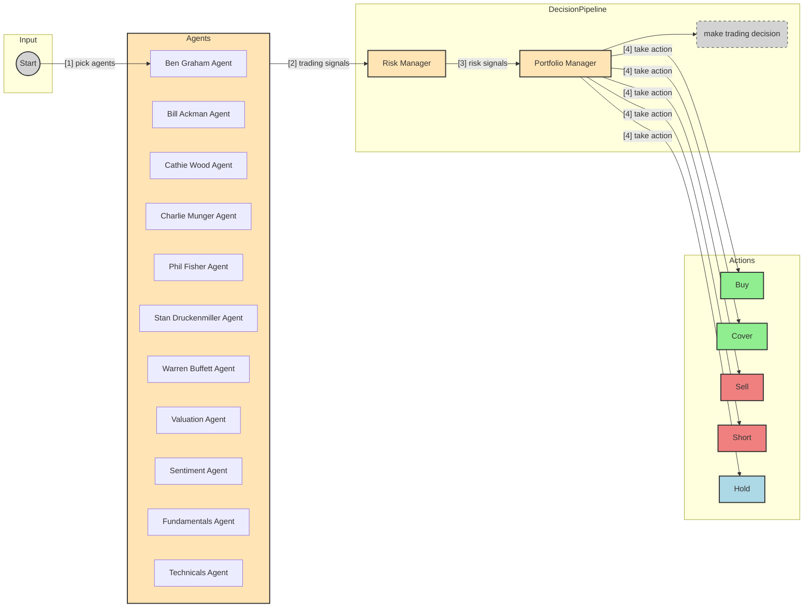

# Plutus

> [!CAUTION]
> Project is in REALLY poor state. Python code needs to be cleaned up and modernized. But, it works.

This is a proof of concept for an AI-powered trading system. The goal of this project is to explore the use of AI to make trading decisions. This project is for **educational** purposes only and is not intended for real trading or investment.

This system employs several agents working together:

1. **Ben Graham Agent** - The godfather of value investing, only buys hidden gems with a margin of safety.
2. **Bill Ackman Agent** - An activist investor, takes bold positions and pushes for change.
3. **Cathie Wood Agent** - The queen of growth investing, believes in the power of innovation and disruption.
4. **Charlie Munger Agent** - Warren Buffett's partner, only buys wonderful businesses at fair prices.
5. **Peter Lynch Agent** - Legendary growth investor who seeks "ten-baggers" and invests in what he knows.
6. **Phil Fisher Agent** - Legendary growth investor who mastered scuttlebutt analysis.
7. **Stanley Druckenmiller Agent** - Macro legend who hunts for asymmetric opportunities with growth potential.
8. **Warren Buffett Agent** - The oracle of Omaha, seeks wonderful companies at a fair price.
9. **Valuation Agent** - Calculates the intrinsic value of a stock and generates trading signals.
10. **Sentiment Agent** - Analyzes market sentiment and generates trading signals.
11. **Fundamentals Agent** - Analyzes fundamental data and generates trading signals.
12. **Technicals Agent** - Analyzes technical indicators and generates trading signals.
13. **Risk Manager** - Calculates risk metrics and sets position limits.
14. **Portfolio Manager** - Makes final trading decisions and generates orders.



**Note**: the system simulates trading decisions, it does not actually trade.

[](https://twitter.com/shaneholloman)

## Disclaimer

This project is for **educational and research purposes only**.

- Not intended for real trading or investment
- No warranties or guarantees provided
- Past performance does not indicate future results
- Creator assumes no liability for financial losses
- Consult a financial advisor for investment decisions

By using this software, you agree to use it solely for learning purposes.

## Table of Contents

- [Prerequisites](#prerequisites)
- [Setup](#setup)
- [Usage](#usage)
    - [Running Plutus](#running-plutus)
    - [Running the Backtester](#running-the-backtester)
- [Project Structure](#project-structure)
- [Contributing](#contributing)
- [Feature Requests](#feature-requests)
- [License](#license)

## Prerequisites

- **Python >= 3.11:** This project requires Python 3.11 or newer.
- **`uv`:** This project uses `uv` for environment and package management. Install it if you haven't already: [https://github.com/astral-sh/uv#installation](https://github.com/astral-sh/uv#installation)

## Setup

1. **Clone the repository:**

    ```sh
    git clone https://github.com/shaneholloman/plutus.git
    cd plutus
    ```

2. **(Optional) Install Python 3.11+ using `uv`:**
    If you don't have a suitable Python version installed, you can install one managed by `uv`:

    ```sh
    # Example: Install Python 3.11
    uv python install 3.11
    # List available/installed versions
    uv python list
    ```

3. **Create and activate the virtual environment:**
    This command creates a `.venv` directory using the specified Python version (or a compatible one found by `uv`) and activates it.

    ```sh
    # Use the specific version you want (e.g., 3.11)
    uv venv --python 3.11
    source .venv/bin/activate
    # On Windows use: .venv\Scripts\activate
    ```

4. **Install dependencies:**
    This installs all packages listed in `pyproject.toml` into your virtual environment.

    ```sh
    uv sync
    ```

5. **Set up environment variables:**
    Copy the example file and add your API keys.

    ```sh
    cp .env.example .env
    ```

    Now, edit the `.env` file and replace the placeholder keys with your actual API keys:

    ```dotenv
    # .env file contents:
    ANTHROPIC_API_KEY=your-anthropic-api-key
    DEEPSEEK_API_KEY=your-deepseek-api-key
    GROQ_API_KEY=your-groq-api-key
    GOOGLE_API_KEY=your-google-api-key
    FINANCIAL_DATASETS_API_KEY=your-financial-datasets-api-key
    OPENAI_API_KEY=your-openai-api-key
    ```

    **Important**: You need to set the API key for at least one LLM provider (`ANTHROPIC_API_KEY`, `GOOGLE_API_KEY`, `OPENAI_API_KEY`, `GROQ_API_KEY`, `DEEPSEEK_API_KEY`) for the application to work. You will be prompted to choose a model from the available providers when running the script.

    Financial data for AAPL, GOOGL, MSFT, NVDA, and TSLA is free via the Financial Datasets API. For any other ticker, you **must** set the `FINANCIAL_DATASETS_API_KEY`.

## Usage

Ensure your virtual environment is activated (`source .venv/bin/activate`).

### Running Plutus

Run the main script, providing the required `--tickers` argument. You will be interactively prompted to select analysts and an LLM model.

```sh
# Basic run with specific tickers
python src/main.py --tickers AAPL,MSFT,NVDA

# Run with reasoning shown
python src/main.py --tickers AAPL,MSFT,NVDA --show-reasoning

# Run for a specific date range
python src/main.py --tickers AAPL,MSFT,NVDA --start-date 2024-01-01 --end-date 2024-03-01
```

**Example Output:** (Output format may vary)

### Running the Backtester

Run the backtester script similarly:

```sh
python src/backtester.py --tickers AAPL,MSFT,NVDA

# Backtest over a specific date range
python src/backtester.py --tickers AAPL,MSFT,NVDA --start-date 2025-01-01 --end-date 2025-03-01
```

**Example Output:** (Output format may vary)

## Project Structure

```tree
plutus/
├── src/
│   ├── agents/                   # Agent definitions and workflow
│   │   ├── bill_ackman.py        # Bill Ackman agent
│   │   ├── fundamentals.py       # Fundamental analysis agent
│   │   ├── portfolio_manager.py  # Portfolio management agent
│   │   ├── risk_manager.py       # Risk management agent
│   │   ├── sentiment.py          # Sentiment analysis agent
│   │   ├── technicals.py         # Technical analysis agent
│   │   ├── valuation.py          # Valuation analysis agent
│   │   ├── warren_buffett.py     # Warren Buffett agent
│   ├── tools/                    # Agent tools
│   │   ├── api.py                # API tools
│   ├── backtester.py             # Backtesting tools
│   ├── main.py                   # Main entry point
├── pyproject.toml
├── uv.lock                     # Lock file generated by uv
├── .env.example                # Example environment variables
├── .env                        # Your environment variables (ignored by git)
├── docs/                       # Documentation
│   └── initial_setup_notes.md  # Notes from initial setup
├── archive/                    # Archived scripts
│   └── fix_unions.py           # Script used during Python 3.9 -> 3.11 transition
├── ...
```

## Contributing

1. Fork the repository
2. Create a feature branch
3. Commit your changes
4. Push to the branch
5. Create a Pull Request

**Important**: Please keep your pull requests small and focused. This will make it easier to review and merge.

## Feature Requests

If you have a feature request, please open an [issue](https://github.com/shaneholloman/plutus/issues) and make sure it is tagged with `enhancement`.

## License

This project is licensed under the MIT License - see the LICENSE file for details.
