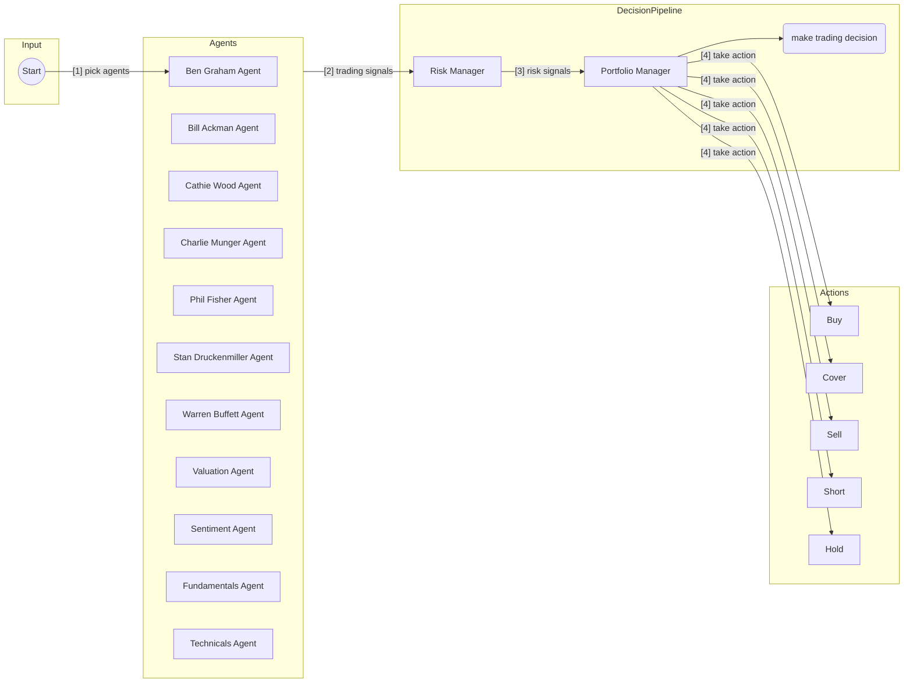

# Plutus

> [!CAUTION]
> Project is in REALLY poor state. Python code needs to be cleaned up and modernized. But, it works.

This is a proof of concept for an AI-powered trading system. The goal of this project is to explore the use of AI to make trading decisions. This project is for **educational** purposes only and is not intended for real trading or investment.

This system employs several agents working together:

1. **Ben Graham Agent** - The godfather of value investing, only buys hidden gems with a margin of safety.
2. **Bill Ackman Agent** - An activist investor, takes bold positions and pushes for change.
3. **Cathie Wood Agent** - The queen of growth investing, believes in the power of innovation and disruption.
4. **Charlie Munger Agent** - Warren Buffett's partner, only buys wonderful businesses at fair prices.
5. **Peter Lynch Agent** - Legendary growth investor who seeks "ten-baggers" and invests in what he knows.
6. **Phil Fisher Agent** - Legendary growth investor who mastered scuttlebutt analysis.
7. **Stanley Druckenmiller Agent** - Macro legend who hunts for asymmetric opportunities with growth potential.
8. **Warren Buffett Agent** - The oracle of Omaha, seeks wonderful companies at a fair price.
9. **Valuation Agent** - Calculates the intrinsic value of a stock and generates trading signals.
10. **Sentiment Agent** - Analyzes market sentiment and generates trading signals.
11. **Fundamentals Agent** - Analyzes fundamental data and generates trading signals.
12. **Technicals Agent** - Analyzes technical indicators and generates trading signals.
13. **Risk Manager** - Calculates risk metrics and sets position limits.
14. **Portfolio Manager** - Makes final trading decisions and generates orders.



**Note**: the system simulates trading decisions, it does not actually trade.

[](https://twitter.com/shaneholloman)

## Disclaimer

This project is for **educational and research purposes only**.

- Not intended for real trading or investment
- No warranties or guarantees provided
- Past performance does not indicate future results
- Creator assumes no liability for financial losses
- Consult a financial advisor for investment decisions

By using this software, you agree to use it solely for learning purposes.

## Table of Contents

- [Prerequisites](#prerequisites)
- [Setup](#setup)
- [Usage](#usage)
    - [Running Plutus](#running-plutus)
    - [Running the Backtester](#running-the-backtester)
- [Project Structure](#project-structure)
- [Contributing](#contributing)
- [Feature Requests](#feature-requests)
- [License](#license)

## Prerequisites

- **Python >= 3.11:** This project requires Python 3.11 or newer.
- **`uv`:** This project uses `uv` for environment and package management. Install it if you haven't already: [https://github.com/astral-sh/uv#installation](https://github.com/astral-sh/uv#installation)

## Setup

1. **Clone the repository:**

    ```sh
    git clone https://github.com/shaneholloman/plutus.git
    cd plutus
    ```

2. **(Optional) Install Python 3.11+ using `uv`:**
    If you don't have a suitable Python version installed, you can install one managed by `uv`:

    ```sh
    # Example: Install Python 3.11
    uv python install 3.11
    # List available/installed versions
    uv python list
    ```

3. **Create and activate the virtual environment:**
    This command creates a `.venv` directory using the specified Python version (or a compatible one found by `uv`) and activates it.

    ```sh
    # Use the specific version you want (e.g., 3.11)
    uv venv --python 3.11
    source .venv/bin/activate
    # On Windows use: .venv\Scripts\activate
    ```

4. **Install dependencies:**
    This installs all packages listed in `pyproject.toml` into your virtual environment.

    ```sh
    uv sync
    ```

5. **Set up environment variables:**
    Copy the example file and add your API keys.

    ```sh
    cp .env.example .env
    ```

    Now, edit the `.env` file and replace the placeholder keys with your actual API keys:

    ```dotenv
    # .env file contents:
    ANTHROPIC_API_KEY=your-anthropic-api-key
    DEEPSEEK_API_KEY=your-deepseek-api-key
    GROQ_API_KEY=your-groq-api-key
    GOOGLE_API_KEY=your-google-api-key
    FINANCIAL_DATASETS_API_KEY=your-financial-datasets-api-key
    OPENAI_API_KEY=your-openai-api-key
    ```

    **Important**: You need to set the API key for at least one LLM provider (`ANTHROPIC_API_KEY`, `GOOGLE_API_KEY`, `OPENAI_API_KEY`, `GROQ_API_KEY`, `DEEPSEEK_API_KEY`) for the application to work. You will be prompted to choose a model from the available providers when running the script.

    Financial data for AAPL, GOOGL, MSFT, NVDA, and TSLA is free via the Financial Datasets API. For any other ticker, you **must** set the `FINANCIAL_DATASETS_API_KEY`.

## Usage

Ensure your virtual environment is activated (`source .venv/bin/activate`).

### Running Plutus

Run the main script, providing the required `--tickers` argument. You will be interactively prompted to select analysts and an LLM model.

```sh
# Basic run with specific tickers
python src/main.py --tickers AAPL,MSFT,NVDA

# Run with reasoning shown
python src/main.py --tickers AAPL,MSFT,NVDA --show-reasoning

# Run for a specific date range
python src/main.py --tickers AAPL,MSFT,NVDA --start-date 2025-01-01 --end-date 2025-03-01
```

**Example Output:** (Output format may vary)

```txt
python src/main.py --ticker AAPL,MSFT,NVDA
? Select your AI analysts. [Cathie Wood]

Selected analysts: Cathie Wood

? Select your LLM model: [gemini] gemini-2.5-pro

Selected Gemini model: gemini-2.5-pro-exp-03-25

 ✓ Cathie Wood         [NVDA] Done
 ✓ Risk Management     [NVDA] Done
 ✓ Portfolio Management[NVDA] Done

Analysis for AAPL
==================================================

AGENT ANALYSIS: [AAPL]
+-------------+----------+--------------+--------------------------------------------------------------+
| Agent       |  Signal  |   Confidence | Reasoning                                                    |
+=============+==========+==============+==============================================================+
| Cathie Wood | BEARISH  |        70.0% | While Apple is undeniably a technology leader with           |
|             |          |              | impressive scale and profitability, its current trajectory   |
|             |          |              | doesn't align with our core focus on disruptive innovation   |
|             |          |              | poised for exponential growth. The analysis indicates R&D    |
|             |          |              | investment sits at only 6.8% of revenue. For companies truly |
|             |          |              | shaping the future and creating new markets, we typically    |
|             |          |              | look for much more aggressive investment in breakthrough     |
|             |          |              | technologies – often exceeding 15-20%. While positive free   |
|             |          |              | cash flow and operating leverage are noted, these metrics    |
|             |          |              | reflect a mature, optimizing company rather than one on the  |
|             |          |              | cusp of exponential disruption. Apple appears focused on     |
|             |          |              | incremental improvements within its established ecosystem,   |
|             |          |              | lacking the clear, game-changing technological shifts or     |
|             |          |              | platform launches we seek that could unlock multi-fold       |
|             |          |              | growth from here. Furthermore, the current valuation         |
|             |          |              | suggests the market has already priced in significant        |
|             |          |              | success, potentially limiting the asymmetric upside          |
|             |          |              | potential we target over a 5+ year horizon. We need to see   |
|             |          |              | clearer evidence of investment in truly transformative areas |
|             |          |              | – like autonomous systems, next-generation AI integration    |
|             |          |              | beyond current capabilities, or novel hardware platforms –   |
|             |          |              | to become bullish on Apple as a core disruptive innovator    |
|             |          |              | for the next decade.                                         |
+-------------+----------+--------------+--------------------------------------------------------------+

TRADING DECISION: [AAPL]
+------------+--------------------------------------------------------------+
| Action     | SHORT                                                        |
+------------+--------------------------------------------------------------+
| Quantity   | 89                                                           |
+------------+--------------------------------------------------------------+
| Confidence | 70.0%                                                        |
+------------+--------------------------------------------------------------+
| Reasoning  | Bearish signal with 70.0 confidence. Opening a short         |
|            | position. The quantity is capped at the max_shares guideline |
|            | (89) for risk management, treating it as a position size     |
|            | limit. The margin requirement is 0.00, so margin             |
|            | availability is not a constraint for this trade size         |
|            | (Position Value: 89 * $222.57 = $19,808.73; Margin Used:     |
|            | $0.00).                                                      |
+------------+--------------------------------------------------------------+

Analysis for MSFT
==================================================

AGENT ANALYSIS: [MSFT]
+-------------+----------+--------------+--------------------------------------------------------------+
| Agent       |  Signal  |   Confidence | Reasoning                                                    |
+=============+==========+==============+==============================================================+
| Cathie Wood | NEUTRAL  |        65.0% | Microsoft stands at the critical intersection of two major   |
|             |          |              | disruptive forces: Cloud Computing via Azure and Artificial  |
|             |          |              | Intelligence, particularly through its integration of        |
|             |          |              | generative AI like Copilot across its vast software suite.   |
|             |          |              | This positioning taps into enormous, expanding TAMs. We see  |
|             |          |              | evidence of their commitment to innovation with increasing   |
|             |          |              | R&D intensity, now at 13.5% of revenue, fueling advancements |
|             |          |              | in these key areas. Their impressive operating margins       |
|             |          |              | (38.9%) and consistent Free Cash Flow generation provide     |
|             |          |              | substantial resources to reinvest in maintaining             |
|             |          |              | technological leadership and scaling these innovations       |
|             |          |              | globally. However, the provided analysis indicates a         |
|             |          |              | significant valuation premium, with the market               |
|             |          |              | capitalization far exceeding calculated intrinsic value      |
|             |          |              | (-50.13% margin of safety). While we firmly believe          |
|             |          |              | traditional valuation metrics often underestimate the        |
|             |          |              | exponential growth trajectories of true disruptors over our  |
|             |          |              | preferred 5+ year horizon, the current valuation demands a   |
|             |          |              | degree of caution. We remain watchful; Microsoft's AI        |
|             |          |              | integration holds transformative potential to reshape        |
|             |          |              | productivity and enterprise operations, creating entirely    |
|             |          |              | new value streams. While the current signal is neutral based |
|             |          |              | on valuation metrics, its strategic positioning in AI and    |
|             |          |              | Cloud keeps it high on our conviction list, pending evidence |
|             |          |              | of AI adoption translating into accelerating growth that     |
|             |          |              | justifies the premium or a more favorable entry point.       |
+-------------+----------+--------------+--------------------------------------------------------------+

TRADING DECISION: [MSFT]
+------------+-------------------------------------------------------+
| Action     | HOLD                                                  |
+------------+-------------------------------------------------------+
| Quantity   | 0                                                     |
+------------+-------------------------------------------------------+
| Confidence | 65.0%                                                 |
+------------+-------------------------------------------------------+
| Reasoning  | Neutral signal (65.0 confidence) indicates no strong  |
|            | directional bias. Holding position as per the signal. |
+------------+-------------------------------------------------------+

Analysis for NVDA
==================================================

AGENT ANALYSIS: [NVDA]
+-------------+----------+--------------+--------------------------------------------------------------+
| Agent       |  Signal  |   Confidence | Reasoning                                                    |
+=============+==========+==============+==============================================================+
| Cathie Wood | BULLISH  |        85.0% | NVIDIA isn't just a semiconductor company; it's the engine   |
|             |          |              | powering the artificial intelligence revolution, a           |
|             |          |              | technological shift we believe is among the most             |
|             |          |              | transformative in history. Their GPUs are the critical       |
|             |          |              | infrastructure enabling breakthroughs across deep learning,  |
|             |          |              | data centers, autonomous systems, and beyond – truly         |
|             |          |              | disruptive innovation at its finest. The data shows          |
|             |          |              | accelerating revenue momentum and, crucially, a massive      |
|             |          |              | commitment to R&D, now at 23.5% of revenue and significantly |
|             |          |              | increasing. This isn't just spending; it's investment in     |
|             |          |              | maintaining leadership and expanding the technological moat  |
|             |          |              | in a market with an almost unimaginable Total Addressable    |
|             |          |              | Market (TAM) as AI integrates into every facet of the global |
|             |          |              | economy. While traditional valuation metrics, like the       |
|             |          |              | calculated intrinsic value showing a large negative margin   |
|             |          |              | of safety, might seem daunting, they often fail to capture   |
|             |          |              | the sheer scale and exponential nature of the S-curve        |
|             |          |              | adoption we anticipate for AI compute over the next 5-10     |
|             |          |              | years. NVIDIA's consistent positive free cash flow fuels     |
|             |          |              | this innovation engine, allowing them to reinvest heavily in |
|             |          |              | future growth platforms like CUDA and their full-stack       |
|             |          |              | solutions. We see NVIDIA as a foundational holding for       |
|             |          |              | exposure to the exponential growth trajectories unlocked by  |
|             |          |              | artificial intelligence, accepting near-term volatility for  |
|             |          |              | the potential of significant long-term, multi-year           |
|             |          |              | appreciation as they continue to execute on their visionary  |
|             |          |              | roadmap.                                                     |
+-------------+----------+--------------+--------------------------------------------------------------+

TRADING DECISION: [NVDA]
+------------+------------------------------------------------------------+
| Action     | BUY                                                        |
+------------+------------------------------------------------------------+
| Quantity   | 183                                                        |
+------------+------------------------------------------------------------+
| Confidence | 85.0%                                                      |
+------------+------------------------------------------------------------+
| Reasoning  | Strong bullish signal (85.0 confidence). Opening a long    |
|            | position. Buying the maximum allowed shares (183) as the   |
|            | total cost (183 * $109.12 = $19,948.96) is well within the |
|            | available portfolio cash ($100,000.00).                    |
+------------+------------------------------------------------------------+

PORTFOLIO SUMMARY:
+----------+----------+------------+--------------+
| Ticker   |  Action  |   Quantity |   Confidence |
+==========+==========+============+==============+
| AAPL     |  SHORT   |         89 |        70.0% |
+----------+----------+------------+--------------+
| MSFT     |   HOLD   |          0 |        65.0% |
+----------+----------+------------+--------------+
| NVDA     |   BUY    |        183 |        85.0% |
+----------+----------+------------+--------------+

Portfolio Strategy:
Bearish signal with 70.0 confidence. Opening a short
position. The quantity is capped at the max_shares guideline
(89) for risk management, treating it as a position size
limit. The margin requirement is 0.00, so margin
availability is not a constraint for this trade size
(Position Value: 89 * $222.57 = $19,808.73; Margin Used:
$0.00).
  plutus 3.11.11  shaneholloman @ bird.yoyo.io  plutus  main 
```

### Running the Backtester

Run the backtester script similarly:

```sh
python src/backtester.py --tickers AAPL,MSFT,NVDA

# Backtest over a specific date range
python src/backtester.py --tickers AAPL,MSFT,NVDA --start-date 2025-01-01 --end-date 2025-03-01
```

**Example Output:** (Output format may vary)

## Project Structure

```tree
plutus/
├── src/
│   ├── agents/                   # Agent definitions and workflow
│   │   ├── bill_ackman.py        # Bill Ackman agent
│   │   ├── fundamentals.py       # Fundamental analysis agent
│   │   ├── portfolio_manager.py  # Portfolio management agent
│   │   ├── risk_manager.py       # Risk management agent
│   │   ├── sentiment.py          # Sentiment analysis agent
│   │   ├── technicals.py         # Technical analysis agent
│   │   ├── valuation.py          # Valuation analysis agent
│   │   ├── warren_buffett.py     # Warren Buffett agent
│   ├── tools/                    # Agent tools
│   │   ├── api.py                # API tools
│   ├── backtester.py             # Backtesting tools
│   ├── main.py                   # Main entry point
├── pyproject.toml
├── uv.lock                     # Lock file generated by uv
├── .env.example                # Example environment variables
├── .env                        # Your environment variables (ignored by git)
├── docs/                       # Documentation
│   └── initial_setup_notes.md  # Notes from initial setup
├── archive/                    # Archived scripts
│   └── fix_unions.py           # Script used during Python 3.9 -> 3.11 transition
├── ...
```

## Contributing

1. Fork the repository
2. Create a feature branch
3. Commit your changes
4. Push to the branch
5. Create a Pull Request

**Important**: Please keep your pull requests small and focused. This will make it easier to review and merge.

## Feature Requests

If you have a feature request, please open an [issue](https://github.com/shaneholloman/plutus/issues) and make sure it is tagged with `enhancement`.

## License

This project is licensed under the MIT License - see the LICENSE file for details.
